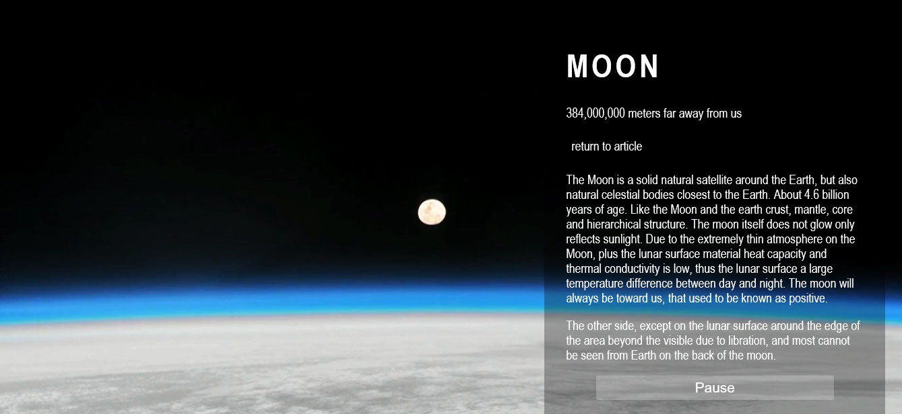

# Video Background
一个可以将视频作为背景的 CSS 样式。

## 使用
### HTML
在 `<body>` 主体中插入多种格式的背景视频：

```html
<video autoplay loop poster="images/moon.jpg" id="moon">
<source src="images/moon.webm" type="video/webm">
<source src="images/moon.mp4" type="video/mp4">
</video>
```

### CSS
使用如下 CSS 样式：

```css
@media screen and (max-width: 500px) {
	div{width:70%;}
}
@media all and (max-device-width: 800px) {
	body {
    background: url("images/moon.jpg") #000 no-repeat center center fixed; 		
    background-size: cover;
  }
	#bgvid, #polina button { display: none; }
	div{width:70%;}
}
```

#### Demo

[Demo Page](https://windmill0503.github.io/demo/video-background/index.html)



#### Legal

Copyright (c) 2016： [windmill0503](https://github.com/windmill0503)